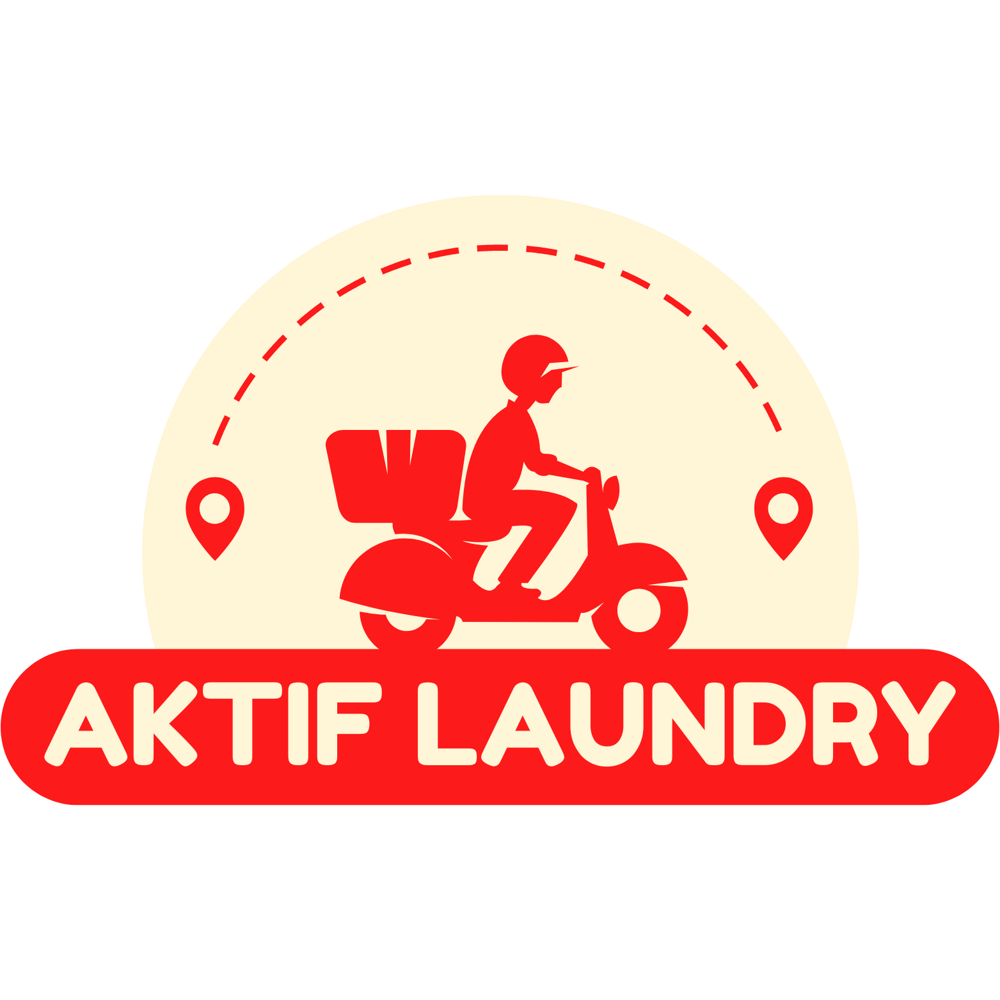

<p align="center">
  
</p>

<h1 align="center">Aktif Laundry Management System</h1>

<p align="center">
  <strong>Sistem Manajemen Laundry Modern dengan Google Sheets sebagai Database</strong>
</p>

<p align="center">
  
  
  
  
</p>

<p align="center">
  
  
  
  
</p>

<p align="center">
  
  
  
</p>

---

## 📋 Deskripsi

**Aktif Laundry** adalah sistem manajemen laundry yang dibangun dengan Laravel 12 dan Livewire 3, menggunakan Google Sheets sebagai database melalui [SheetDB.io](https://sheetdb.io) API. Sistem ini dilengkapi dengan Google Apps Script (GAS) untuk automasi dan manajemen data di Google Sheets.

### ✨ Fitur Utama

- 🧺 **Manajemen Pelanggan** - CRUD pelanggan dengan tracking status
- 🏷️ **Manajemen Layanan** - Kelola berbagai jenis layanan laundry
- 👕 **Manajemen Jenis Pakaian** - Kategorisasi jenis pakaian
- 💰 **Kasir & Transaksi** - Point of Sale untuk transaksi laundry
- 📊 **Dashboard** - Statistik dan overview bisnis
- 🧾 **Cetak Struk** - Generate dan cetak struk transaksi
- ⚙️ **Pengaturan Toko** - Konfigurasi data toko
- 🔐 **Authentication** - Sistem login custom
- 📱 **Responsive Design** - Tampilan optimal di semua device

---

## 🛠️ Tech Stack

### Backend
- **Laravel 12.x** - PHP Framework
- **Livewire 3.6** - Full-stack framework untuk Laravel
- **SheetDB PHP SDK** - Client library untuk SheetDB.io API

### Frontend
- **Mary UI (Robsontenorio/Mary)** - TailwindCSS component library untuk Livewire
- **TailwindCSS** - Utility-first CSS framework
- **Alpine.js** - Lightweight JavaScript framework (via Livewire)

### Database & Storage
- **Google Sheets** - Database utama via SheetDB.io
- **SQLite** - Local storage untuk session & cache
- **SheetDB.io API** - Bridge antara aplikasi dan Google Sheets

### Google Apps Script
- **Custom Menu** - Menu automation di Google Sheets
- **Data Validation** - Validasi otomatis untuk input data
- **Auto ID Generation** - Generate ID otomatis
- **Dummy Data Generator** - Tool untuk insert data testing

---

## 📦 Struktur Database (Google Sheets)

Project ini menggunakan 6 sheets utama:

### 1. Users
| Username | Password |
|----------|----------|

### 2. Pelanggan
| ID | Nama | No. HP | Alamat | Email | Tanggal Daftar | Total Transaksi | Status |
|----|------|--------|--------|-------|----------------|-----------------|--------|

### 3. Layanan
| ID | Nama Layanan | Harga per Kg | Durasi (Jam) | Deskripsi | Status |
|----|--------------|--------------|--------------|-----------|--------|

### 4. JenisPakaian
| ID | Nama Jenis | Keterangan | Status |
|----|------------|------------|--------|

### 5. Transaksi
| ID | Tanggal Masuk | ID Pelanggan | Nama Pelanggan | ID Layanan | Nama Layanan | Jenis Pakaian | Berat (Kg) | Harga per Kg | Subtotal | Diskon | Total | Metode Pembayaran | Tanggal Selesai | Status | Catatan |
|----|---------------|--------------|----------------|------------|--------------|---------------|------------|--------------|----------|--------|-------|-------------------|-----------------|--------|---------|

### 6. Setting
| Key | Value | Deskripsi |
|-----|-------|-----------|

---

## 🚀 Installation

### Prerequisites
- PHP >= 8.2
- Composer
- Node.js & NPM
- Google Account (untuk Google Sheets)
- SheetDB.io Account

### Step 1: Clone Repository
```bash
git clone https://github.com/denis156/aktif-laundry-laravel.git
cd aktif-laundry-laravel
```

### Step 2: Install Dependencies
```bash
composer install
npm install
```

### Step 3: Environment Setup
```bash
cp .env.example .env
cp .clasp.json.example .clasp.json
php artisan key:generate
```

Edit file `.env`:
```env
APP_NAME="Aktif Laundry"
APP_URL=https://aktif-laundry-laravel.test

# SheetDB.io Configuration
API_DBSHEET=your_sheetdb_api_id
API_DBSHEET_CACHE_KEY=your_cache_key

# Database (untuk session & cache)
DB_CONNECTION=sqlite
SESSION_DRIVER=database
QUEUE_CONNECTION=database
CACHE_STORE=database
```

Edit file `.clasp.json`:
```json
{
  "scriptId": "your_google_apps_script_id_here",
  "rootDir": "./GAS"
}
```

### Step 4: Setup Database & Build Assets
```bash
touch database/database.sqlite
php artisan migrate
npm run build
```

### Step 5: Setup Google Sheets

#### A. Create Google Spreadsheet
1. Buka Google Sheets
2. Buat spreadsheet baru
3. Copy semua file dari folder `GAS/` ke Apps Script Editor

#### B. Deploy Google Apps Script
1. Buka spreadsheet > Extensions > Apps Script
2. Paste semua code dari folder `GAS/`:
   - `Code.gs` - Entry point & main functions
   - `SheetsSetup.gs` - Setup sheets & structure
   - `DummyData.gs` - Dummy data generator
   - `appsscript.json` - Configuration

3. Klik tombol Deploy:
   - New Deployment
   - Type: Web app
   - Execute as: **Me**
   - Who has access: **Anyone**
   - Deploy

4. Refresh spreadsheet, akan muncul menu "🧺 Aktif Laundry"

#### C. Setup Sheets Structure
1. Di menu Google Sheets, pilih: `🧺 Aktif Laundry` > `⚙️ Setup` > `Setup Sheets`
2. Wait hingga proses selesai
3. (Optional) Insert dummy data: `Setup` > `Insert Dummy Data`

#### D. Connect to SheetDB.io
1. Login ke [SheetDB.io](https://sheetdb.io)
2. Create new API
3. Paste Google Sheets URL
4. Copy API ID
5. Update `.env` file dengan API ID

### Step 6: Run Application

#### Development Mode
```bash
composer dev
```
Atau manual:
```bash
# Terminal 1 - Laravel Server
php artisan serve

# Terminal 2 - Queue Worker
php artisan queue:listen

# Terminal 3 - Asset Watcher
npm run dev
```

#### Production Build
```bash
npm run build
php artisan serve
```

---

## 📁 Struktur Project

```
aktif-laundry-laravel/
├── app/
│   ├── Livewire/              # Livewire Components
│   │   ├── Kasir.php          # POS System
│   │   ├── Pelanggan/         # Customer Management
│   │   ├── Layanan/           # Service Management
│   │   ├── JenisPakaian/      # Clothing Type Management
│   │   ├── Transaksi/         # Transaction Management
│   │   └── Pengaturan.php     # Settings
│   └── Services/              # (Jika ada custom services)
│
├── GAS/                       # Google Apps Script Files
│   ├── Code.gs                # Main entry point
│   ├── SheetsSetup.gs         # Setup & structure
│   ├── DummyData.gs           # Dummy data generator
│   └── appsscript.json        # GAS configuration
│
├── public/
│   └── images/
│       └── Logo.png           # App Logo
│
├── resources/
│   ├── views/
│   │   └── livewire/          # Livewire Blade Templates
│   └── css/
│
├── routes/
│   └── web.php                # Application Routes
│
└── .env                       # Environment Configuration
```

---

## 🎯 Usage

### Menu Kasir (Point of Sale)
1. Pilih atau buat pelanggan baru
2. Pilih layanan laundry
3. Input jenis pakaian dan jumlah
4. Input berat cucian
5. Pilih metode pembayaran
6. Proses transaksi
7. Cetak struk

### Manajemen Data
- **Pelanggan**: `/pelanggan` - CRUD pelanggan
- **Layanan**: `/layanan` - CRUD layanan laundry
- **Jenis Pakaian**: `/jenis-pakaian` - CRUD jenis pakaian
- **Transaksi**: `/transaksi` - View & manage semua transaksi

### Google Apps Script Menu
Di Google Sheets, tersedia menu custom:
- **Setup Sheets** - Create all required sheets
- **Insert Dummy Data** - Populate with sample data
- **Clear All Data** - Remove all data (keep headers)
- **Refresh Data** - Force recalculation

---

## 🔧 Configuration

### SheetDB.io Setup
1. Buat account di [SheetDB.io](https://sheetdb.io)
2. Create API dari Google Sheets URL
3. Copy API ID ke `.env`:
   ```env
   API_DBSHEET=your_api_id_here
   ```

### Cache Configuration
Untuk performa optimal, SheetDB.io menyediakan caching. Update di `.env`:
```env
API_DBSHEET_CACHE_KEY=your_cache_key
```

### Google Sheets Timezone
Edit `GAS/appsscript.json`:
```json
{
  "timeZone": "Asia/Makassar"
}
```

---

## 📝 API Integration

### SheetDB.io Endpoints
```php
// Read all data
GET https://sheetdb.io/api/v1/{api_id}

// Read specific sheet
GET https://sheetdb.io/api/v1/{api_id}?sheet=Pelanggan

// Search
GET https://sheetdb.io/api/v1/{api_id}/search?Status=Aktif

// Create
POST https://sheetdb.io/api/v1/{api_id}

// Update
PATCH https://sheetdb.io/api/v1/{api_id}/ID%20Pelanggan/{id}

// Delete
DELETE https://sheetdb.io/api/v1/{api_id}/ID%20Pelanggan/{id}
```

Dokumentasi lengkap: [SheetDB API Docs](https://docs.sheetdb.io)

---

## 🎨 UI Components

Project ini menggunakan [Mary UI](https://mary-ui.com) - collection of TailwindCSS components untuk Livewire:

- Forms (Input, Select, Textarea, etc.)
- Tables dengan pagination
- Modals & Drawers
- Toast Notifications
- Cards & Badges
- Buttons & Icons

---

## 🧪 Testing

### Insert Dummy Data
Via Google Sheets menu: `🧺 Aktif Laundry` > `⚙️ Setup` > `Insert Dummy Data`

Data yang akan ditambahkan:
- 3 Users
- 10 Pelanggan
- 8 Layanan
- 15 Jenis Pakaian
- 15 Transaksi
- 11 Setting

---

## 🐛 Troubleshooting

### SheetDB.io Connection Error
1. Pastikan API ID benar di `.env`
2. Cek Google Sheets permission (Anyone with link can view)
3. Verify SheetDB.io API status

### Google Apps Script Error
1. Cek timezone di `appsscript.json`
2. Pastikan web app deployed dengan access "Anyone"
3. Clear cache: `Extensions` > `Apps Script` > Re-deploy

### Session/Cache Issues
```bash
php artisan cache:clear
php artisan config:clear
php artisan view:clear
```

---

## 📄 License

This project is open-sourced software licensed under the [MIT license](https://opensource.org/licenses/MIT).

---

## 👨‍💻 Developer

**Denis Djadian Ardika**

- GitHub: [@denis156](https://github.com/denis156)
- Project: [aktif-laundry-laravel](https://github.com/denis156/aktif-laundry-laravel)

---

## 🙏 Acknowledgements

- [Laravel](https://laravel.com) - The PHP Framework
- [Livewire](https://livewire.laravel.com) - Full-stack framework
- [Mary UI](https://mary-ui.com) - TailwindCSS Components
- [SheetDB.io](https://sheetdb.io) - Google Sheets API
- [TailwindCSS](https://tailwindcss.com) - CSS Framework
- [Google Apps Script](https://developers.google.com/apps-script) - Automation Platform

---

## 📞 Support

Jika ada pertanyaan atau issue:
1. Buka [Issues](https://github.com/denis156/aktif-laundry-laravel/issues)
2. Atau contact developer

---

<p align="center">Made with ❤️ for Laundry Business</p>
<p align="center">© 2025 Aktif Laundry. All rights reserved.</p>
